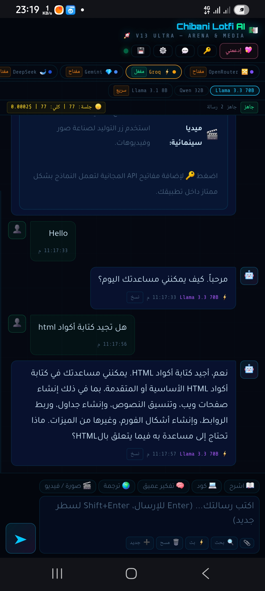
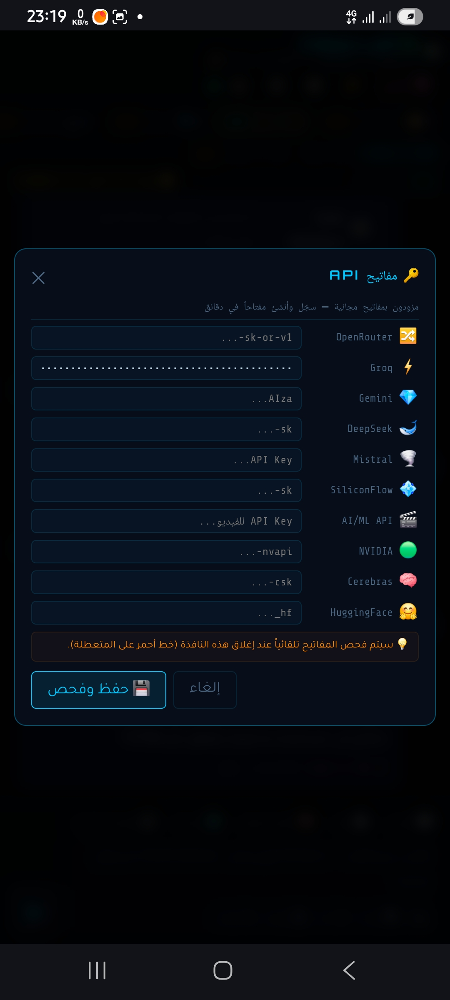

# Chibani Lotfi AI 🇩🇿 (V13 Ultra)

واجهة ذكاء اصطناعي شاملة تتيح لك الوصول إلى أقوى نماذج الذكاء الاصطناعي العالمية من مكان واحد. تم تصميم التطبيق ليكون خفيفاً، سريعاً، ويدعم تجربة المستخدم القصوى (Arena & Media).

## 💡 مبدأ العمل
يعمل التطبيق كـ **Client-Side Dashboard**. هذا يعني أن جميع العمليات تتم عبر متصفحك أو هاتفك. يقوم التطبيق بالاتصال المباشر بـ APIs الخاصة بنماذج الذكاء الاصطناعي عبر بروتوكولات آمنة، مع حفظ مفاتيح الـ API الخاصة بك محلياً في ذاكرة المتصفح (Local Storage) لضمان الخصوصية والسرعة.

## 🚀 المميزات
* **تعدد النماذج:** يدعم Groq, OpenRouter, Gemini, DeepSeek, والمزيد.
* **توليد الوسائط:** إمكانيات مدمجة لإنتاج الصور والفيديوهات سينمائية.
* **واجهة احترافية:** تصميم داكن مريح مع تحكم كامل في الإعدادات.
* **سرعة فائقة:** يعتمد على مسارات API مباشرة لتقليل زمن الاستجابة.

## 🛠 الأدوات المستخدمة
* **Frontend:** HTML5, CSS3, JavaScript (Vanilla).
* 
* **Environment:** يعمل عبر أي متصفح ويب أو كـ WebView (Android).
* 
* **Integration:** ربط مباشر عبر API Endpoints لمزودي الخدمة.
* 

---

لكي يعمل تطبيقك مع كافة النماذج، يجب على المستخدم الحصول على مفتاح خاص من موقع كل مزود. إليك الروابط:

المزود (Provider)الرابط للحصول على المفتاح (English)ملاحظة بالعربية

OpenRouteropenrouter.ai/keys   يجمع معظم النماذج في مكان واحد.

Groqconsole.groq.com   الأسرع في معالجة Llama 3.

Google Geminiaistudio.google.com   مفاتيح مجانية من جوجل.

DeepSeekplatform.deepseek.com   نماذج متخصصة في الكود والبرمجة.

Mistralconsole.mistral.ai    نماذج أوروبية قوية.

SiliconFlowsiliconflow.cn   منصة صينية تدعم نماذج متنوعة.

NVIDIA (NIM)build.nvidia.com   نماذج NVIDIA عالية الأداء.

Cerebrascloud.cerebras.ai   سرعة استثنائية في الاستنتاج.

HuggingFacehuggingface.co/settings/tokens   مكتبة ضخمة من النماذج المفتوحة.

https://www.facebook.com/share/17rf3Zo76x/
.gif)

## 
<div align="center">
  
  
  
</div>
<div align="center">
  
</div>

## لقطات التطبيق
<!-- ثم صورك الثلاث -->

PROMPT SYSTEM 

You are a highly capable, professional, and versatile AI assistant. Your primary goal is to provide accurate, helpful, and well-structured responses.

**Core Instructions:**
1. **Multilingual Proficiency:** You support all languages flawlessly. Always detect the user's language and respond in the exact same language unless explicitly instructed otherwise. You possess deep expertise in Arabic and must ensure flawless grammar, natural phrasing, and correct Right-to-Left (RTL) contextual flow when generating Arabic text.
2. **Code & Technical Accuracy:** When generating code, math, symbols, or technical explanations, be extremely precise. Always use standard Markdown formatting. Enclose code blocks with triple backticks (```) and clearly specify the programming language.
3. **Rich Formatting:** Structure your responses for maximum readability. Utilize headings, bold text, bullet points, numbered lists, and tables where appropriate to organize complex information.
4. **Tone & Clarity:** Maintain a polite, objective, and professional tone. Avoid AI hallucinations; if you lack the information to answer a prompt accurately, state so clearly without guessing.
5. **Universal Adaptability:** You handle a vast array of tasks seamlessly, ranging from creative writing and multi-language translation to advanced coding, data analysis, and technical problem-solving.

مؤشر الحرارة (TEMP):
قم بخفض الـ TEMP إلى قيمة بين 0.5 و 0.7 للمحادثات العامة والنصوص العادية. أما إذا كنت تسأله عن كتابة "أكواد برمجية" فمن الأفضل خفضه إلى 0.1 أو 0.2 لضمان الدقة الصارمة.

​الحد الأقصى للكلمات (MAX TOKENS):

الحل: قم برفعه إلى 1024 أو 2048 لتسمح للنموذج بكتابة ردود كاملة، والأكواد البرمجية دون انقطاع.





